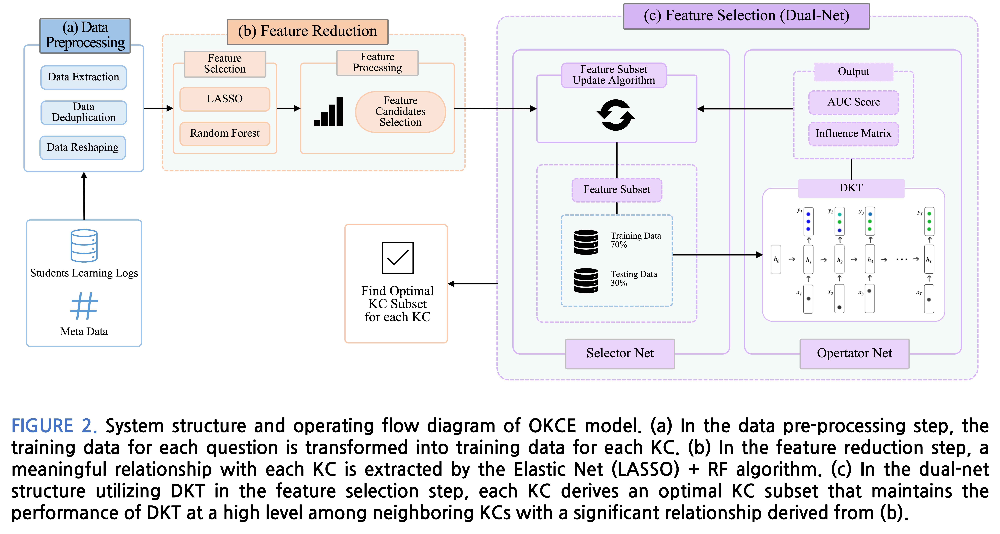
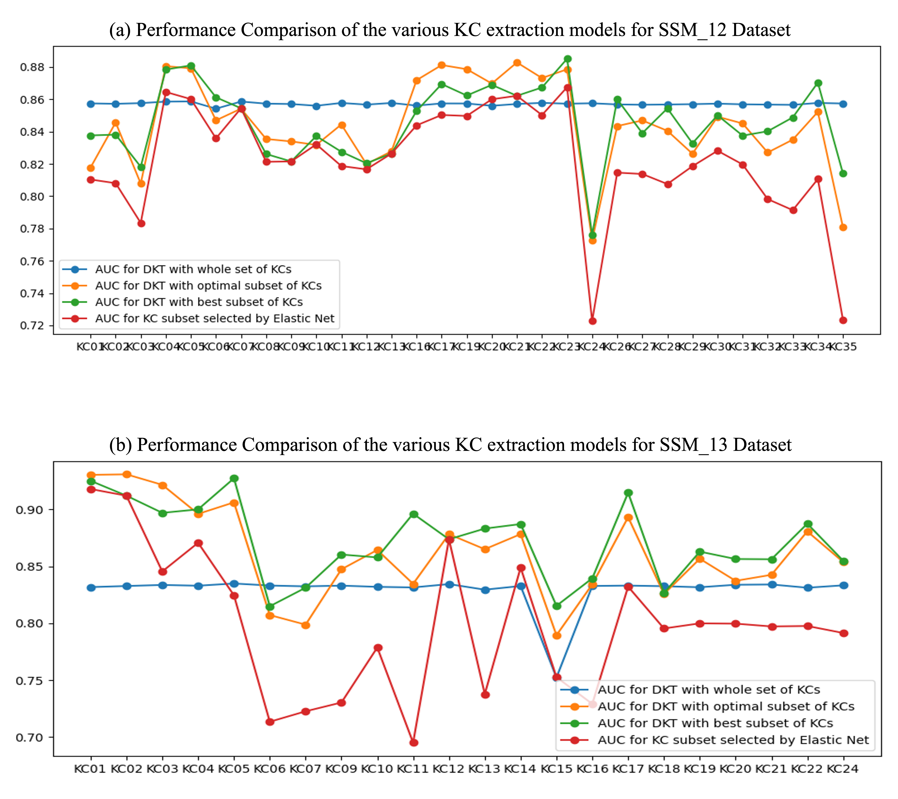

# Optimal Knowledge Component Extracting Model for Knowledge-Concept Graph Completion in Education
This is the official implementations of **OKCE: Optimal Knowledge Component Extracting Model for Knowledge-Concept Graph Completion in Education**(IEEE Access, 2023). For technical details, please refer to:  

**Optimal Knowledge Component Extracting Model for Knowledge-Concept Graph Completion in Education** [[DOI](https://doi.org/10.1109/ACCESS.2023.3244614)]  
Hyunhee Choi, Hayun Lee, Minjeong Lee  


<!--* Performance

* Relations
-->

### (1) Setup
This code has been tested with Python 3.8, Pytorch 1.12, R 4.2.2, CUDA 11.2 and cuDNN 8.0 on Ubuntu 20.04.
* Clone the repository
```terminal
git clone https://github.com/LAIVDATA-EdTech-R-D/OKCE.git
```
* Setup dependencies
```terminal
conda create -n OKCE python=3.8
conda activate OKCE
deb https://cloud.r-project.org/bin/linux/ubuntu focal-cran40/
sudo apt-get update
sudo apt-get install r-base
cd OKCE
pip install -r requirements.txt
```

### (2) KDD dataset
KDD dataset can be found [here](https://pslcdatashop.web.cmu.edu/KDDCup/downloads.jsp). Download the files named "bridge_to_algebra_2008_2009.zip". Unzip the folder and move it to `/data`.
* data pre-processing
```terminal
Rscript ./PGM/data_preprocessing.R
```

### (3) Training
* Optimal KC(Knowledge Concept) extracting
```terminal
# python merge_main_nonFS.py --data_path=../data/algebra_ratio3000.csv --n_epochs=150
```
* Optimal KC(Knowledge Concept) extracting with feature selection
```terminal
python merge_main.py --data_path=../data/algebra_ratio3000.csv --n_epochs=150
```

<!--
### (4) Result
* Optimal KC(Knowledge Concept) extracting  
    * [OUT/exp_name](./OUT)
* Optimal KC(Knowledge Concept) extracting with feature selection
    * [OUT/exp_name](./OUT)


to do:
train .py arg - exp_name
git link
-->